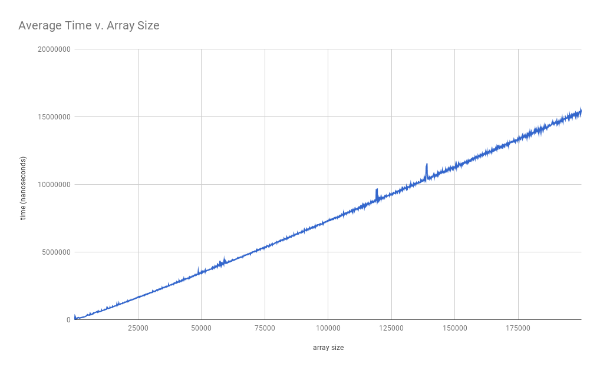

# Hillbilly-Cletus
# QuickSort
Clarence Cheng, Kerwin Chen, George Washington Carver Jr.

# Hypothesis
Given that the size of an array n, its runtime in a circumstance most unfavorable would be O(n^2)

# Background
In this lab we searched through arrays using a special partition() method. We used many varying sizes to show us an average runtime for the entire thing. 

# Experiment Methodology
QuickSort 
Essentially, what you are doing is that you are partitioning the array into two sections, one section that is lower and one section that is higher, and then yourecursively do that with each of the left and right parts, picking partitions and sorting them into the "bigger" and "smaller" piles".

# Conclusion
We were expecting an increase as the array size increased, but instead of a logarithmic increase, we got a more linear increase. We are not sure why. 
