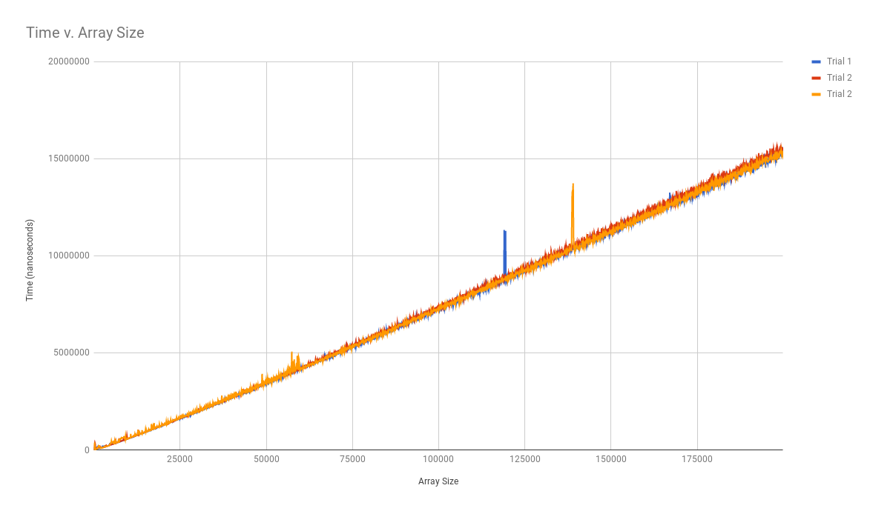

# Hillbilly-Cletus
# QuickSort
Clarence Cheng, Kerwin Chen, George Washington Carver Jr.

# Hypothesis
Given that the size of an array n, its runtime in a circumstance most unfavorable would be O(n^2)

